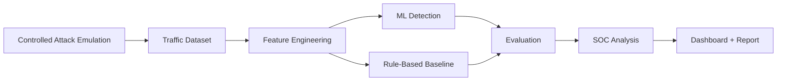

# Slow & Low IoT DDoS Detection Architecture

## Detection Focus

The project focuses on temporal and behavioral traffic features that can help identify low-rate attacks that may evade simple volume thresholds.

## Security Boundary

Attack generation must run only in isolated, controlled environments against systems where testing is authorized.
